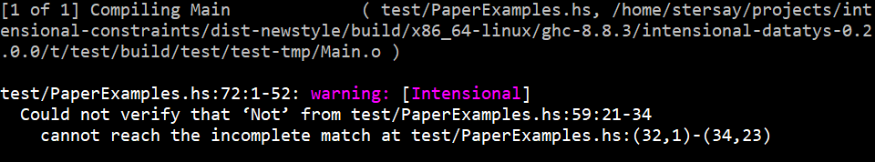

# Intensional Datatype Refinement Checking

The pattern-match safety problem is to verify that a given functional program will never crash due to nonexhaustive
patterns in its function definitions. This tool is designed to verify pattern-match safety of Haskell programs.

Consider the following definition of formulas and disjunctive normal form (DNF) from [PaperExamples.hs](test/PaperExamples.hs):
````
  data Fm = 
      Lit L
      | Not Fm
      | And Fm Fm
      | Or Fm Fm
      | Imp Fm Fm

  distrib xss yss = List.nub [ List.union xs ys | xs <- xss, ys <- yss ]

  nnf2dnf (And p q) = distrib (nnf2dnf p) (nnf2dnf q)
  nnf2dnf (Or p q)  = List.union (nnf2dnf p) (nnf2dnf q)
  nnf2dnf (Lit a)   = [[a]]
  nnf2dnf _         = error "Impossible!"

  nnf' :: Fm -> Fm
  nnf' (And p q) = And (nnf' p) (nnf' q)
  nnf' (Or p q) = Or (nnf' p) (nnf' q)
  nnf' (Imp p q) = Or (Not (nnf' p)) (nnf' q) 
  nnf' (Not (Not p)) = nnf' p 
  nnf' (Not (And p q)) = Or (nnf' (Not p)) (nnf' (Not q))
  nnf' (Not (Or p q)) = And (nnf' (Not p)) (nnf' (Not q))
  nnf' (Not (Imp p q)) = And (nnf' p) (nnf' (Not q))
  nnf' (Not (Lit (Atom x))) = Lit (NegAtom x)
  nnf' (Not (Lit (NegAtom x))) = Lit (Atom x)
  nnf' (Lit (Atom x)) = Lit (Atom x)
  nnf' (Lit (NegAtom x)) = Lit (NegAtom x)

  dnf' = nnf2dnf . nnf'

````
The function ``nnf2dnf`` has (effectively) only partial patterns, for example ``Imp p q`` is omitted, because it expects its argument to be in negation normal form and thus not contain any occurrences of ``Imp`` or ``Not``.  However, the definition of ``dnf'`` ensures that any input to ``nnf2dnf`` is of the correct form (assuming the definition of ``nnf'`` is correct).  

However, the definition of ``nnf'`` is not correct.  Can you spot the error?  Our tool can analyse how this program will behave at runtime and notices that ``nnf'`` can let a rogue ``Not`` through in some cases.  In particular, the following use of ``dnf`` will result in the program crashing with an exception:
````
  willCrash = 
    dnf' (Imp (Lit (Atom 1)) 
              (And (Lit (Atom 2)) 
                  (Or (Lit (NegAtom 3)) (Lit (Atom 1)))))
````

When we try to compile this file with our plugin enabled, after a few milliseconds we get:



The warning tells us that it is the ``Not`` created on line 60 that leaks out of the function (this is the ``Imp`` case of ``nnf``) and that the call on lines 73--76 (this is the definition of ``willCrash``) will cause that ``Not`` to reach the incomplete pattern match on lines 32--35 (this is the definition of ``nnf2dnf``).

On the other hand, the analysis also understands that the usage in the following definition will not exercise the faulty ``Imp`` case of ``nnf'`` and hence no warning is issued for this line of code:
````
  willNotCrash = dnf' (And (Lit (Atom 1)) (Lit (Atom 2)))
````

Internally, the tool is using a kind of refinement type system in order to statically approximate which constructors are flowing to which points of the program.  The system is carefully designed so that inference is completely automatic and runs in time that is linear in the size of the program, but exponential in the underlying (Haskell) type of the program.  In particular, it is exponential in the size of the datatype definitions, so the analysis may struggle if your program has very large datatypes.  However, we have successfully analysed many large packages from Hackage (subject to the significant [limitations](#limitations) in the current implementation, discussed below).

The same example [file](test/PaperExamples.hs) also contains a non-faulty implementation ``nnf``.  The type assigned to ``nnf`` describes a function that will never return a value built with ``Not`` or ``Implies`` (in fact the type is 'flow-sensitive' which means, in this case, that it says which constructors will be in the output given which constructors were in the input).  Take a look at [Viewing the inferred types](#viewing-inferred-types) to see the type.


## Usage

The tool is a plugin for GHC, and is integrated into the compilation pipeline.  Since it depends on the GHC API directly, it is currently tied to GHC >= 8.6 and <=8.8.4 so first ensure you have a compatible version of the compiler.

### Invoke via GHC directly
To add the analysis to compilation using GHC directly from the command line, first install the ``intensional-datatys`` package from Hackage:
````
  $ cabal update
  Downloading the latest package list from hackage.haskell.org
  $ cabal install intensional-datatys
  Resolving dependencies...
````
Then use the flags ``-package intensional-datatys``, ``-fplugin Intensional``, ``-g``,  ``-fno-ignore-interface-pragmas``, and ``-fno-omit-interface-pragmas`` when invoking GHC as usual, e.g:
````
  $ ghc -g -fno-ignore-interface-pragmas -fno-omit-interface-pragmas -package intensional-datatys -fplugin Intensional Main.hs
````
The latter three ensure that the compiler can properly detect when a branch will immediately throw an error.
Optionally, add the flags detailed [here](#optional-ghc-flags) to the command line invocation to help the analysis efficiency or to view inferred types interactively.


### Invoke via an (existing) Cabal project
To add this analysis as another stage to compilation for a Haskell project with a working cabal description
and access to Hackage:
  
  1. Add ``intensional-datatys`` to the ``build-depends`` field of the target that you want to analyse.
  2. Add ``-fplugin Intensional`` to the ``ghc-options`` field.
  3. Add ``-g``, ``-fno-ignore-interface-pragmas``, and ``-fno-omit-interface-pragmas`` to the ``ghc-options`` field.
  3. Optionally, add flags detailed [here](#optional-ghc-flags) to ``ghc-options`` to help the analysis efficiency or to view inferred types interactively.

### Interpreting the output 
In the terminal you will find notifications of any warnings produced by the tool, which can be identified by the ``Intensional`` label in square brackets.

````
  test/PaperExamples.hs:(73,1)-(76,56): warning: [Intensional]
    Could not verify that ‘Not’ from test/PaperExamples.hs:60:21-34
      cannot reach the incomplete match at test/PaperExamples.hs:(32,1)-(35,39)
````

The warnings record instances where the tool *believes* there will be a pattern-match violation at runtime.
If there are no warnings, then the code has been verified as free from pattern-match safety violations at runtime, subject to the [limitations](#limitations) discussed below.

The first line of the warning gives the location of the error.
The second line of the warning gives a datatype constructor and the location in the source that the constructor is created.
The third line of the warning gives the location in the source code of an incomplete pattern.
The warning is being reported because, after analysing how the program will behave, the tool cannot exclude the possibility that the given incomplete pattern will not be matched to the given constructor at runtime, which result in an exception.


### Optional GHC flags
  
  We recommend the following additional flags which turn off inlining and other GHC optimisations whilst retaining strictness analysis.

      * ``-O0``
      * ``-fno-pre-inlining``
      * ``-funfolding-use-threshold=0``
  
  To view the types inferred for a module ``m`` or any module that ``m`` depends on, use the following flag and see section [Viewing Inferred Types](#viewing-inferred-types).

      * ``-fplugin-opt Intensional:m``


## Limitations
As this is only a prototype tool, it's interface and deployment are not well developed!  
In particular, many features of Haskell are not properly analysed, notably:
* Type classes
* GADTs
* Higher-ranked types

We do not analyse any code that is not from the home package (i.e. in the source files being compiled) and so we do not refine any types that are not defined in your program. For example, we do not track the control flow of ``Maybe`` or ``Bool``.

For efficiency, we do not allow empty refinements of single-constructor datatypes.  This gives great savings when there are many newtypes, records and wrapper datatypes and are not a major concern of our work.

## Viewing inferred types
If the flag ``-fplugin-opt Intensional:m`` is used then, following the compilation of module ``m``, a very simple REPL will be presented from which you can issue commands to view inferred types of- or the GHC core associated with top-level functions.

* To view the type of a compiled module-level function ``f``, issue the command ``:t f``.
````
  Main> :t nnf
  nnf : forall X Y.inj_X Fm -> inj_Y Fm
        where
          [Imp] in X(Fm) ? Not <= X(Fm)
          [Imp] in X(Fm) ? Or <= Y(Fm)
          [Or] in X(Fm) ? Or <= Y(Fm)
          [And, Not] in X(Fm) ? Or <= Y(Fm)
          [And] in X(Fm) ? And <= Y(Fm)
          [Imp, Not] in X(Fm) ? And <= Y(Fm)
          [Not, Or] in X(Fm) ? And <= Y(Fm)
          [Lit, Not] in X(Fm), [NegAtom] in X(L) ? Lit <= Y(Fm)
          [Lit, Not] in X(Fm), [Atom] in X(L) ? Lit <= Y(Fm)
          [Lit] in X(Fm), [NegAtom] in X(L) ? Lit <= Y(Fm)
          [Lit] in X(Fm), [Atom] in X(L) ? Lit <= Y(Fm)
          [Lit, Not] in X(Fm), [NegAtom] in X(L) ? Atom <= Y(L)
          [Lit] in X(Fm), [Atom] in X(L) ? Atom <= Y(L)
          [Lit, Not] in X(Fm), [Atom] in X(L) ? NegAtom <= Y(L)
          [Lit] in X(Fm), [NegAtom] in X(L) ? NegAtom <= Y(L)
````
* To view the GHC Core associated with a module-level function ``f``, issue ``:c f``
````
    Main> :c dnf
    src<test/PaperExamples.hs:36:1-19>
    . @ Fm
      @ [[L]]
      @ Fm
      (src<test/PaperExamples.hs:36:7-13> nnf2dnf)
      (src<test/PaperExamples.hs:36:17-19> nnf)
````
* To resume compilation, issue ``:q ``.

Functions from module dependencies of ``m`` can also be queried by using their fully-qualified names.

  
## Troubleshooting 

* I get warnings about constructors created in typeclass functions that are not creating anything!  
    - See [limitations](#limitations), currently typeclass functions are overapproximated so the tool believes they return all constructors for the given type.

* I ran the tool and it seemed to compile without any warnings at all, but I was expecting some!
    - Are you sure that the source was actually compiled?  The tool is part of the usual compilation pipeline, so if nothing changes in the source, GHC will not recompile the file.

* I can't seem to get the tool to work because of some Cabal dependency issues!
    - Perhaps you are not using GHC 8.8.3 or 8.8.4.  Sorry about that, but the tool uses the GHC API directly, so the version is important.
